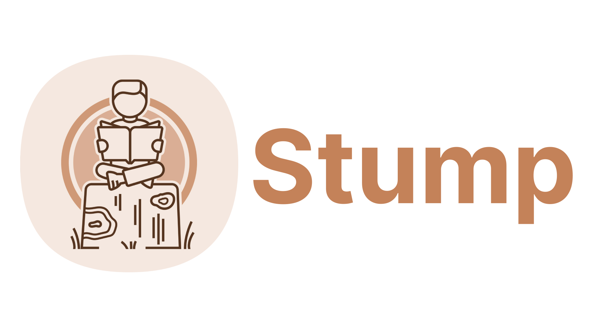

# 

A free and open source comics server with OPDS support, **heavily** inspired by [Komga](https://github.com/gotson/komga).

I love Komga and use it at home, and I thought it would be cool to learn what goes into making something like this myself. I opted to develop this in Rust to hopefully, at the end of all this, create something just as if not almost as convenient but with a smaller footprint. _I also just want to practice Rust!_

## Roadmap

I moved my roadmap/todo list to a [GitHub Project](https://github.com/users/aaronleopold/projects/1) to keep it more organized since the codebase is growing. Have a look, I am very open to suggestions and ideas!

## Getting Started

There are no releases yet, so you'll have to clone the repo and build it yourself:

```bash
git clone https://github.com/aaronleopold/stump.git
cd stump
pnpm frontend:install
cargo install cargo-watch
```

## Running Stump

### Development

To start the application for development, simply run:

```bash
pnpm dev
```

This will start both the svelte dev server and the rust server, watching for changes. You can also run the server and the frontend in separate processes:

```bash
pnpm server:dev # start the server
pnpm frontend:dev # start the frontend
```

### Docker

No images have been published to dockerhub yet, so you'll have to build it yourself:

```bash
pnpm server:build:docker-alpine # builds the image
docker create \
  --name=stump \
  --user 1000:1000 \
  -p 6969:6969 \
  --volume ~/.stump:/home/stump/.stump \
  --mount type=bind,source=/path/to/data,target=/data \
  --restart unless-stopped \
  stump # creates the container
docker start stump # runs the container
```

As of now, you'll need to make the `source` and `target` paths match. So if you keep your libraries in `/Users/user/Library`, you'll need to bind `/Users/user/Library` to both `source` and `target`. This will eventually change to be more flexible.

## Contributing

Contributions are very **encouraged** and **welcome**! Please open an issue prior to working on a bug or feature to let me know what you're interested in working on. Thanks!
